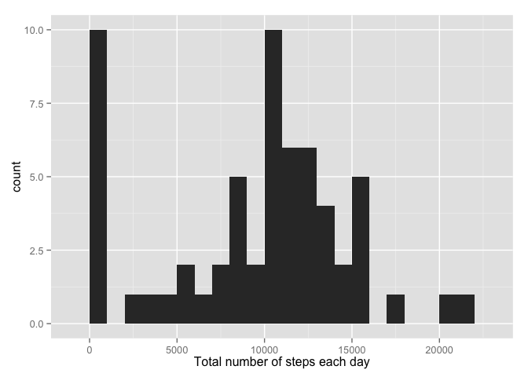
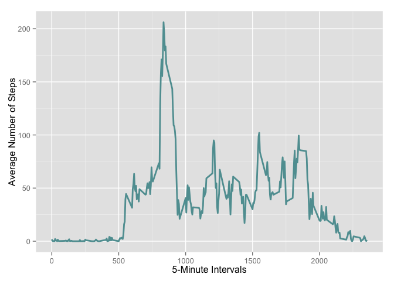
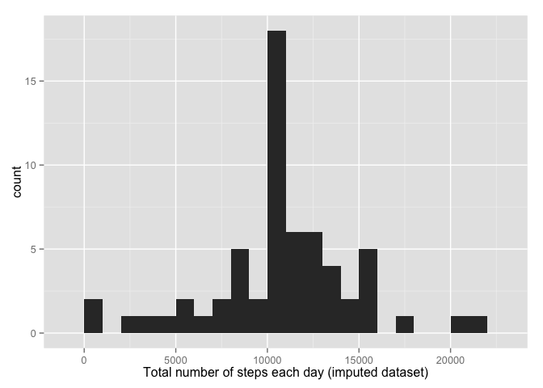
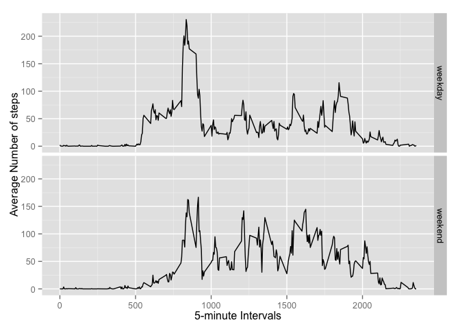

# Reproducible Research: Peer Assessment 1


```r
library(ggplot2)
```

## Loading and preprocessing the data


```r
if(!file.exists('activity.csv')){
    unzip('activity.zip')
}
active <- read.csv('activity.csv')
```

## What is mean total number of steps taken per day?

1) Calculating the total number of steps taken per day.  
For this part, as suggested by the prompt, we ignore the missing values in the data


```r
daily.step.sum<-tapply(active$steps,active$date, FUN=sum, na.rm=TRUE)
```
2) A hitogram of the total number of steps taken each day is given below

```r
qplot(daily.step.sum, binwidth =1000, xlab = "Total number of steps each day")
```

 

3) Calculating the mean and median of the total number of steps taken daily.

```r
mean.daily.steps<-mean(daily.step.sum,na.rm=TRUE)
median.daily.steps<-median(daily.step.sum, na.rm=TRUE)
```
The mean of the total number of steps taken each day is 9354.2295082 and 
the median is 10395.


## What is the average daily activity pattern?

1) Using the ggplot2 system we make a plot of the average number of steps taken 
(averaged over all days), and the 5-minute intervals.

```r
average.interval <- aggregate(steps ~ interval, active, mean, na.rm = TRUE)
ggplot(average.interval, aes(x=interval,y=steps)) + geom_line(color="cadetblue",size=1) +  
  labs(x="5-Minute Intervals", y="Average Number of Steps")
```

 

2) Maximum number of steps


```r
max.steps.interval<-average.interval[which.max(average.interval$steps), ] 
max.steps.interval
```

```
##     interval    steps
## 104      835 206.1698
```
Once we look across all days in the dataset, the 5-minute interval where the 
maximum  number of steps were taken, and the maximum number of steps themselves were 835, 206.1698113


## Imputing missing values

1) Calculating the total number of missing values

```r
missing.total<-sum(is.na(active$steps))
```
The total number of missing values is 2304

2-3) Devising an imputation strategy and adding the imputed values to a new dataset


```r
imputing <- function(steps, interval) {
  fill <- NA
  if (!is.na(steps))
    fill <- c(steps)
  else
    fill <- (average.interval[average.interval$interval==interval, "steps"])
  return(fill)
}
```
Since we already calculated the average number of steps taken in each time interval (averaged over all days) we can use these values to impute the missing values in the data. 

```r
active.imputed<- active
active.imputed$steps <- mapply(imputing, active.imputed$steps, active.imputed$interval)
```
4) A hitogram of the total number of steps taken each day and the corresponding mean
and median values are given bellow:

```r
daily.step.sum.imputed <- tapply(active.imputed$steps, active.imputed$date, FUN=sum)
qplot(daily.step.sum.imputed, binwidth=1000, xlab="Total number of steps each day (imputed dataset)")
```

 

```r
mean.daily.steps.imp<-format(mean(daily.step.sum.imputed),scientific=FALSE)
median.daily.steps.imp<-format(median(daily.step.sum.imputed), scientific=FALSE)
```
The histogram above gives the daily total steps for the imputed data set. In the first
part of this assignment we ignored the missing values, and R treated them all as 0s, which 
subsequently affetcted the total number of steps and the mean and median values. By filling the 
missing value with average number of steps for each interval we notice a reduction of 0s in the histogram. This would also bring the mean and median value up, and, in fact, this is true, as the mean number of daily steps for the imputed data is 10766.19 and the median is 
10766.19.
 
## Are there differences in activity patterns between weekdays and weekends?
1) First, using the imputed data we create a new "weekend"/"weekday" variable

```r
active.imputed$datetype<-ifelse(as.POSIXlt(active.imputed$date)$wday %in% c(0,6), 'weekend', 'weekday')
active.imputed$datetype<-as.factor(active.imputed$datetype)
```
2) Then we create a panel plot containing time series plots of the 5-minute intervals and 
the average number of steps taken, where we average across both weekdays and weekend days.
We notice that while the average number of steps is higher on weekdays between the 500th to 1000th time interval relative to weekends, on average this individual seems to be making a higher number of steps on weekend days relative to weekdays when looking acroos all 5-minute intervals (as a whole). In other words, this individual seems to be a bit more active on weekends. 


```r
average.interval.imputed <- aggregate(steps ~ interval + datetype, data=active.imputed, mean)
ggplot(average.interval.imputed, aes(interval, steps)) + geom_line() + facet_grid(datetype ~ .) +
  xlab("5-minute Intervals") + ylab("Average Number of steps")
```

 
